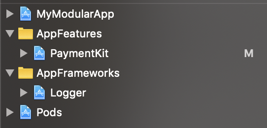
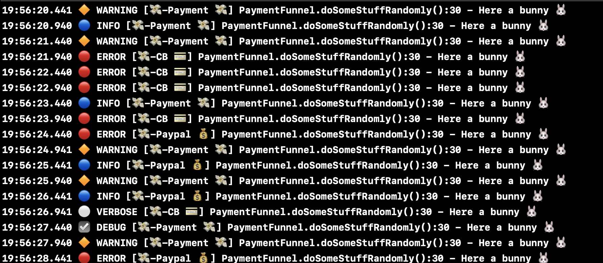
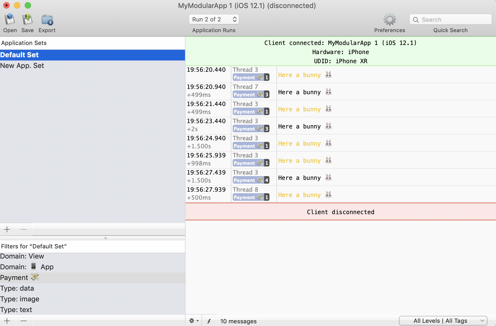
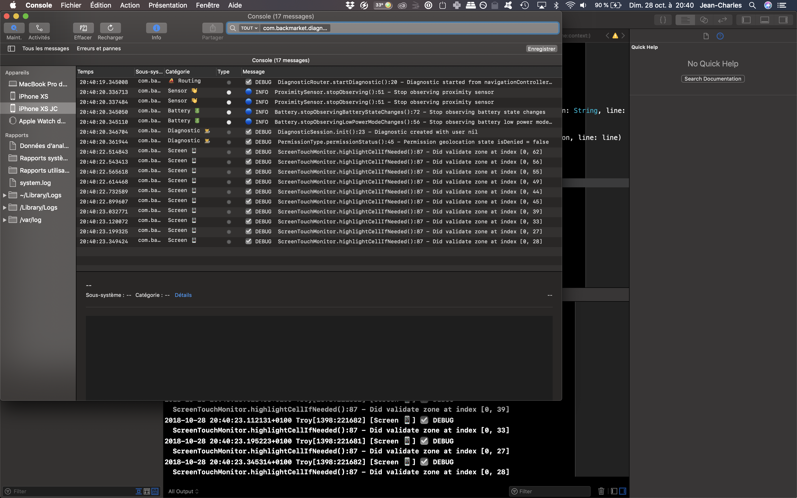
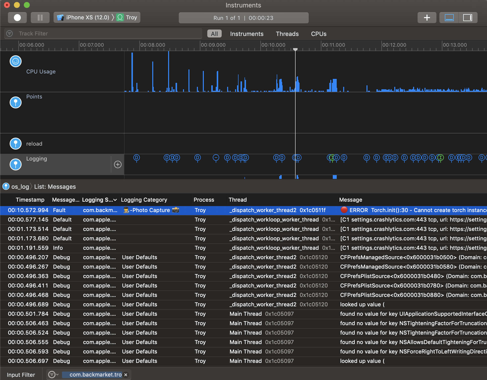

# LoggerLayer

**Make your logs flexbile &amp; scalable for your product and your team!**

Example of a Logger Layer in an iOS Swift project. 

## Original idea

During developing & architecturing iOS apps at [Back Market](https://www.backmarket.com), I've started using [SwiftyBeaver](https://github.com/SwiftyBeaver/SwiftyBeaver) a lot, as the base of my logging layer. But I think it was a bad thing to keep one third-dependency for logging across our apps.

I keep the idea and some code about SwiftyBeaver, tune it, add a better context representation and make a flexible logging layer, which enables to add, change or remove destinations better than ever before (like SwiftyBeaver, NSLogger or OSLog).

## Real-world context

Today, apps become more and more complexes, with big teams & production monitoring. 
So, you have to structure your app efficiently and make your team flexible at the same time: each developer has his debugging preferences.

Logs are essential too: create boards on [Datadog](https://www.datadoghq.com/) or any Cloud Platform, create alerts, log non-fatal errors. They are here to make your real-time production analysis faster than ever before.

To do it, here we create a Logger layer, to be able to change, add or remove any destinations or third party library around the app logging; all of this, without change your original logger calls across your app & modules.

GDPR is also complicated to manage into apps. By architecturing this layer, you can enable or disable logs categories easily. 

It will save your developer life 😉.

Enjoy!

### Modular app

### Console logs

### NSLogger logs filtering

### OSLog

Console.app & Instruments

### Etc.

## The talk & slides

The original idea of this architecture is from [my talk at Cocoaheads Paris](https://www.meetup.com/fr-FR/CocoaHeads-Paris/events/fgvkkqyxpblb/) of November 2018.

**Slides are [here](https://speakerdeck.com/bill350/flexible-and-scalable-logs-on-ios).**

## Author

Jean-Charles SORIN, iOS Lead at [BackMarket](https://www.backmarket.com).

[Follow me!](https://twitter.com/jcsorin)